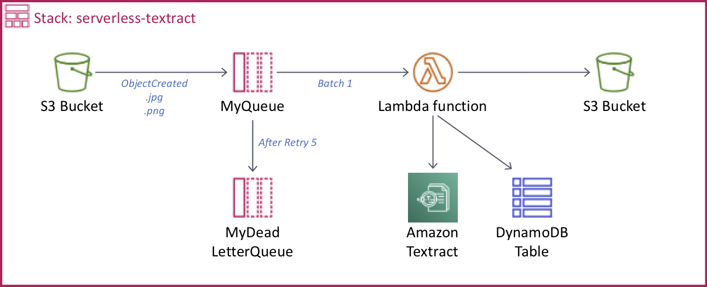

# ice-breaker
This ice-breaker is for IA topic before begin a courses about Cloud Public

# # ONBOARDING TEXTRACT WORKSHOP

Work inside your AWS Cloud9 or local environment.



## Install dependencies

1/ Install & configure aws-cli: https://docs.aws.amazon.com/cli/latest/userguide/getting-started-install.html  


2/ Install Serverless CLI tool https://serverless.com/framework/docs/providers/aws/guide/installation/

``` bash
npm install -g serverless
```

## Deploy 

``` bash
serverless deploy --stage TEAMNAME --aws-profile AWSPROFILE
```

## Testing

Go and upload the images in the bucket